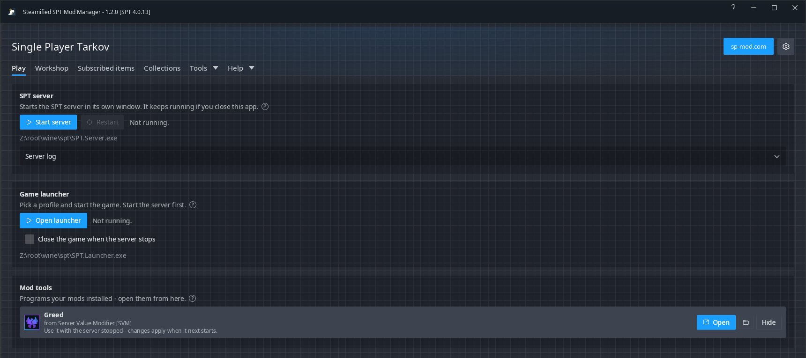
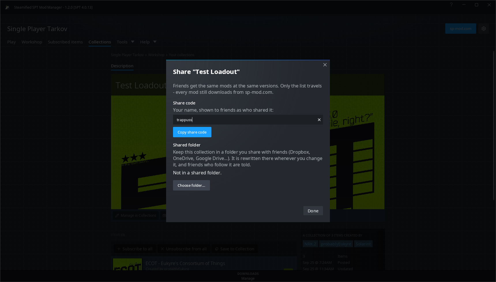

# SSPTMM - Steamified SPT Mod Manager

A Windows app for finding, installing and keeping track of [SPT](https://sp-tarkov.com) (Single
Player Tarkov) mods, laid out and styled like Steam's Workshop. Mods and collections come from
[sp-mod.com](https://sp-mod.com); nothing needs an account or an API key.

**[Download the latest release](https://github.com/trappuss/SSPTMM/releases/latest)** ·
**[Wiki](https://github.com/trappuss/SSPTMM/wiki)** ·
**[Changelog](CHANGELOG.md)** ·
**[Report a problem](https://github.com/trappuss/SSPTMM/issues)**

## What it does

- **Workshop** - Home, Browse with Steam's filters and sorts, hover popups and Quick View, authors'
  pages, and an item page with the description exactly as its author wrote it, change notes,
  versions and comments.
- **Subscribe** - installs a mod and what it needs, up to three downloads at once. Unsubscribe
  removes it, with Undo for a while afterwards. Download only, and Install from file for an archive
  you already have.
- **Subscribed items** - everything in your SPT install as cards, a list or your own groups: update
  all, enable and disable, presets of which mods are on and off (and Disable all for
  troubleshooting), pin, spot re-uploads, and a warning before removing a mod that changes your
  profile.
- **Collections** - public collections from sp-mod.com, your own collections, and sharing them with
  friends by code or shared folder.
- **Play** - start the server and the game, read the server log, close the game, and open the tools
  your mods installed (SVM's Greed, give-ui...). Before you launch it warns about conflicts and about
  mods that need something missing or switched off. Experimental, off by default: pick a profile and
  press PLAY - server and game start with no SPT launcher window.
- **Tools** - Configs, Dependencies and Conflicts, and **Diagnose logs**, which reads SPT's logs and
  says what went wrong and which mod it came from.
- **Safety** - a copy of your SPT profiles before anything changes the install, your BepInEx
  settings kept, SPT's own files protected, every install checked file by file, and an install cut
  off part-way (a crash, the power going) put on record so it can be finished or removed.
- **Updates itself** - Help > About says when a new SSPTMM is out, and **Install update** puts it
  in place for you.

| | |
|---|---|
|  |  |
|  |  |
|  |  |

More screenshots of every page are in the [wiki](https://github.com/trappuss/SSPTMM/wiki).

## What SSPTMM adds over TCF Mod Manager

SSPTMM began as a fork of TCF Mod Manager, and everything it does is still here. On top of it:

### Your mods' tools, one click away

Some mods ship a program of their own, like **SVM's Greed** (the Server Value Modifier's editor) or
**give-ui**. After you subscribe, the **Play** page lists every program your mods put in the SPT
folder. **Open** starts it in the right folder, and the folder button opens the mod's own folder
(for SVM, its presets). SSPTMM also knows when a tool wants the server stopped (Greed) or running
(give-ui), and says so. If you disable the mod, its tool is greyed out.

### Collections you can share

- **Browse sp-mod.com's public collections** inside the app.
- **Subscribe to all** of a collection, at the versions for your SPT or the collection's.
- **Make your own** from the mods you have installed.
- **Share with friends in two ways:**
  - a **share code**: one line of text that fits in a Discord message;
  - a **shared folder** (Dropbox, OneDrive, Google Drive), which keeps everyone's copy up to date.
- **When a friend's collection changes,** SSPTMM says exactly what was added or removed and offers
  **Sync**. Only the list travels; every mod still downloads from sp-mod.com.

### Diagnose logs

Reads SPT's server log, BepInEx's log and the game's error log, and says in plain words what went
wrong. When the log shows it, it also says which mod caused it. Examples:

- a mod that didn't load, and what it was missing;
- two mods that don't work together;
- raid results that weren't saved;
- a profile that won't load.

**Copy a report for help** takes out your user name, user folder, profile ids and players' IP
addresses.

### A Steam Workshop to browse

- **Browsing:** hover previews with each mod's pictures, Quick View, authors' pages, and following
  authors.
- **Item pages:** sp-mod.com's comments, change notes for every version, and YouTube videos, all
  inside the app.
- **Badges:** every card shows whether you have the mod, it needs an update, or it's disabled.

### Safer installs

- **Profile backups:** a copy of your SPT profiles before anything changes your install.
- **Held-back updates:** an update that would break another installed mod is held back - left out
  of Update all and never announced.
- **Interrupted installs:** an install cut off part-way is put on record at the next start, so
  it can be finished or cleanly removed.
- **Re-upload detection:** spots a mod re-uploaded under the same version number.
- **SPT upgrade check:** shows which of your mods are ready for a newer SPT.
- **Install from file:** installs an archive you already have.

### More control from the Play page

- **Warnings before you launch:** conflicts, and mods that need something missing or switched off.
- **Server:** stop it, run it without its window, and read its log live.
- **Game:** close it, optionally whenever the server stops.
- **Experimental:** start the game straight from SSPTMM with no SPT launcher window.

Everything that differs, item by item, is in the wiki:
[Changes from TCF Mod Manager](https://github.com/trappuss/SSPTMM/wiki/Changes-from-TCF-Mod-Manager).

## Install

1. Download `SSPTMM-<version>-win-x64.zip` from
   [Releases](https://github.com/trappuss/SSPTMM/releases/latest).
2. Unzip it into your SPT folder (the one with `EscapeFromTarkov.exe`). The zip holds one folder,
   so you get `SPT\SSPTMM\`. Anywhere else works too - just never inside `BepInEx\plugins` or
   `user\mods`.
3. Run `SSPTMM\SSPTMM.exe`.
4. Unzipped into your SPT folder, SSPTMM finds that install by itself - the window title shows your
   SPT version. Anywhere else, open **Options** (the gear, top right), set **SPT Install Folder** to
   the folder with `EscapeFromTarkov.exe` in it, and press **Save**.

### Updating

From 1.3.0, **Help > About** shows when a newer release is out and has an **Install update**
button: it asks first, downloads the release from this repository, closes SSPTMM, puts the new
version over its folder and starts it again. Your settings in `Data` stay. Or update by hand: close
SSPTMM and unzip the new release to the same place. Coming from 1.2.x, update by hand once.

Windows 10 or 11. The download is self-contained: no .NET install needed. Settings, caches and logs
live in a `Data` folder beside the exe, so SSPTMM never touches another mod manager or another copy of itself.
Made and tested for SPT 4.0 and 4.1.

## Credits

SSPTMM began as a fork of **[TCF Mod Manager](https://sp-mod.com/mod/2945/tcf-mod-manager) by
TheCrimsonFckr** (MIT), whose mod handling, installing and removing it was built on. It is now
developed on its own, with its own look, names, settings and version numbers. Yes I reached out and got permission before uploading.

Code goes both ways: TCF Mod Manager has since taken several SSPTMM features (profile backups, the
download queue, kept BepInEx settings and more), and SSPTMM takes fixes back from TCF Mod Manager's
later releases, credited in [CHANGELOG.md](CHANGELOG.md) and in the code.

Everything it adds, changes or leaves out compared with TCF Mod Manager 1.19.0-beta, the release it
was based on, is in
[Changes from TCF Mod Manager](https://github.com/trappuss/SSPTMM/wiki/Changes-from-TCF-Mod-Manager).

Problems with SSPTMM belong in this repository's
[Issues](https://github.com/trappuss/SSPTMM/issues). Diagnose logs' **Copy a report for help** gives
you a report to paste there, with your user name, user folder, profile ids and IP addresses taken
out.

## Building from source

Two files do everything:

- **`SSPTMM-build-and-run.bat`** - installs the .NET 9 SDK into the folder if the PC has none,
  builds, runs the tests, publishes a self-contained `SSPTMM.exe` into `dist\SSPTMM\` and starts it.
  When there is a `steam-workshop-ui.bundle` in `Claude outputs\`, it brings that update in first.
- **`SSPTMM-upload-to-github.bat`** - puts the code on GitHub. When the version in
  `build\Directory.Build.props` is new, it also makes the release: builds and tests it, zips it and
  publishes it with its CHANGELOG section. It asks before sending anything.

`tools\SSPTMM-test-checklist.bat` walks through testing a release by hand on a fresh SPT install and
writes a report to `test-reports\`. See
[Building from source](https://github.com/trappuss/SSPTMM/wiki/Building-from-Source) in the wiki.

## More

- [CHANGELOG.md](CHANGELOG.md) - what each release changed.
- [docs/steam-workshop-ui.md](docs/steam-workshop-ui.md) - how each Steam page was matched, what was
  measured, and every change round by round.
- [docs/server-map-guide.md](docs/server-map-guide.md) - setting up the Server Map mod on a server.
- [Files and network](https://github.com/trappuss/SSPTMM/wiki/Files-and-Network) - every file SSPTMM
  keeps and every server it talks to.
- [docs/branding](docs/branding) - the icon, banners, mascot and sp-mod.com thumbnail, in every size.

## License

MIT - see [LICENSE](LICENSE), which also keeps TCF Mod Manager's MIT copyright notice. The libraries
and runtime in the release build are listed with their licences in
[THIRD-PARTY-NOTICES.md](THIRD-PARTY-NOTICES.md).

Steam and the Steam Workshop are trademarks of Valve Corporation. SSPTMM is an independent fan
project, not affiliated with or endorsed by Valve, Battlestate Games, the SPT project or
sp-mod.com.
