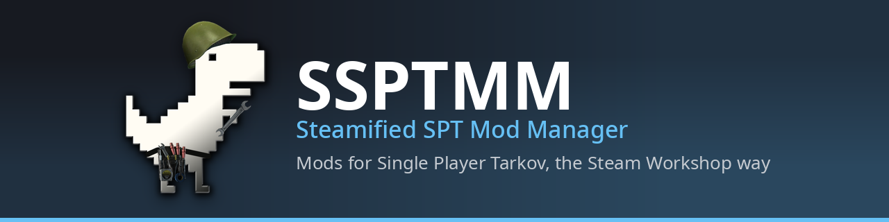
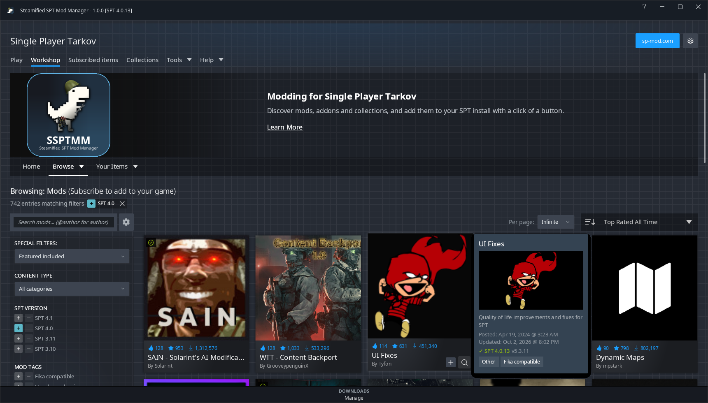
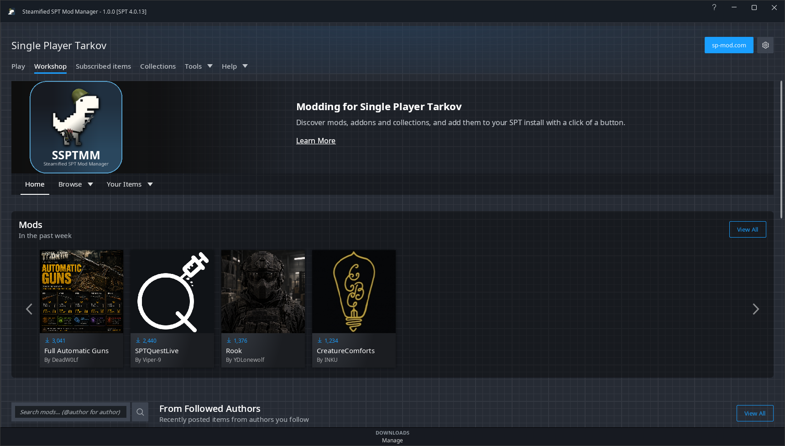
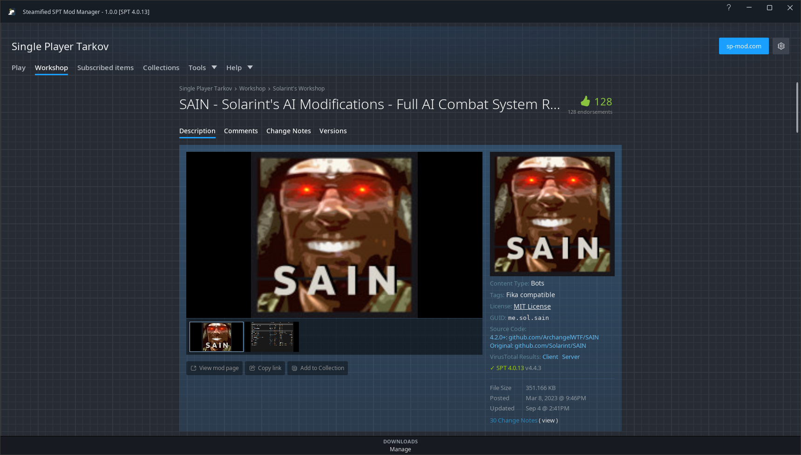
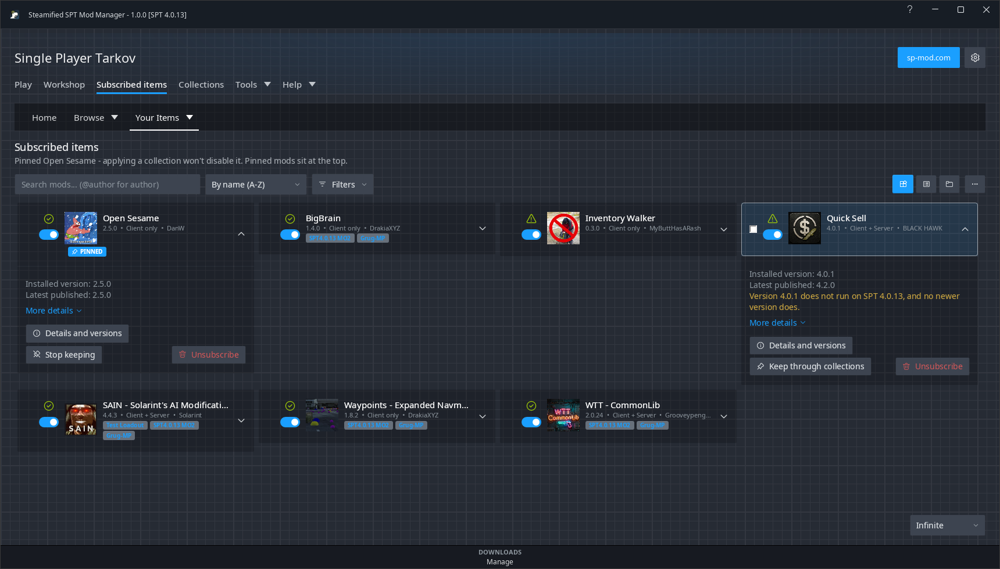
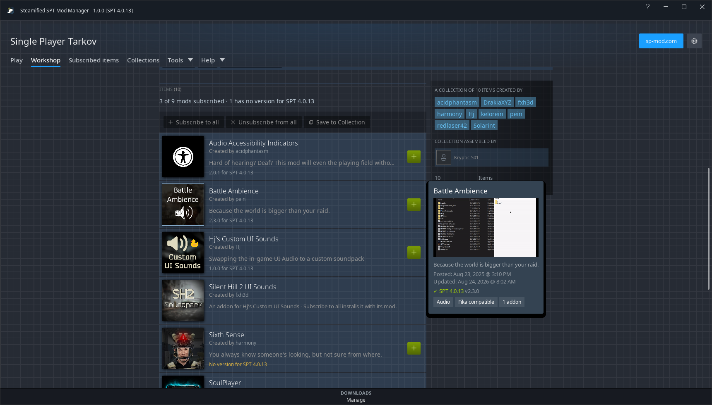
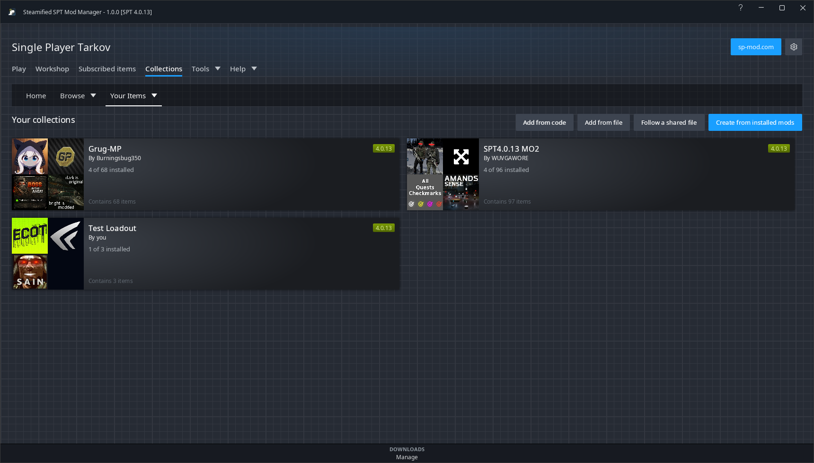
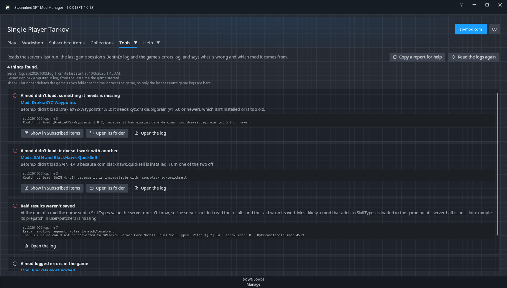

# SSPTMM - Steamified SPT Mod Manager

A Windows app for finding, installing and keeping track of [SPT](https://sp-tarkov.com) (Single
Player Tarkov) mods, laid out and styled like Steam's Workshop. Mods and collections come from
[sp-mod.com](https://sp-mod.com); nothing needs an account or an API key.

**[Download the latest release](https://github.com/trappuss/SSPTMM/releases/latest)** ·
**[Wiki](https://github.com/trappuss/SSPTMM/wiki)** ·
**[Changelog](CHANGELOG.md)** ·
**[Report a problem](https://github.com/trappuss/SSPTMM/issues)**

## What it does

- **Workshop** - Home, Browse with Steam's filters and sorts, hover popups and Quick View, authors'
  pages, and an item page with the description exactly as its author wrote it, change notes,
  versions and comments.
- **Subscribe** - installs a mod and what it needs, up to three downloads at once. Unsubscribe
  removes it, with Undo for a while afterwards. Download only, and Install from file for an archive
  you already have.
- **Subscribed items** - everything in your SPT install as cards, a list or your own groups: update
  all, enable and disable, pin, spot re-uploads, and a warning before removing a mod that changes
  your profile.
- **Collections** - public collections from sp-mod.com, your own collections, and sharing them with
  friends by code or shared folder.
- **Play** - start the server and the game, read the server log, close the game, and open the tools
  your mods installed (SVM's Greed, give-ui...).
- **Tools** - Configs, Dependencies and Conflicts, and **Diagnose logs**, which reads SPT's logs and
  says what went wrong and which mod it came from.
- **Safety** - a copy of your SPT profiles before anything changes the install, your BepInEx
  settings kept, SPT's own files protected, and every install checked file by file.

| | |
|---|---|
|  |  |
|  |  |
|  |  |

More screenshots of every page are in the [wiki](https://github.com/trappuss/SSPTMM/wiki).

## Install

1. Download `SSPTMM-<version>-win-x64.zip` from
   [Releases](https://github.com/trappuss/SSPTMM/releases/latest).
2. Unzip it into a folder of its own - **not** inside `BepInEx\plugins` or `user\mods`.
3. Run `SSPTMM.exe`.
4. Open **Options** (the gear, top right), set **SPT Install Folder** to the folder with
   `EscapeFromTarkov.exe` in it, and press **Save**. The window title then shows your SPT version.

Windows 10 or 11. The download is self-contained: no .NET install needed. Settings, caches and logs
live in a `Data` folder beside the exe, so SSPTMM never touches TCF Mod Manager or another copy.
Works with SPT 3.x and 4.x.

## Based on TCF Mod Manager

SSPTMM is built on **[TCF Mod Manager](https://sp-mod.com/mod/2945/tcf-mod-manager) by
TheCrimsonFckr**: its mod handling, install and removal, and much of what is under the Steam look
are that app's work. SSPTMM is a separate app with its own look, names and version numbers; newer
TCF Mod Manager releases are merged in from time to time (Help > About says which one). TCF Mod
Manager's own README is in [docs/tcf-mod-manager-readme.md](docs/tcf-mod-manager-readme.md).

Problems with SSPTMM belong in this repository's
[Issues](https://github.com/trappuss/SSPTMM/issues) - not with TCF Mod Manager. Diagnose logs'
**Copy a report for help** gives you a report to paste there, with your user name, folders and ids
taken out.

## Building from source

Double-click **`SSPTMM-build-and-run.bat`**. It installs the .NET 9 SDK into the folder if the PC
has none, builds, runs the tests, publishes a self-contained `SSPTMM.exe` into `dist\SSPTMM\` and
starts it. `SSPTMM-test.bat` runs the tests on their own. See
[Building from source](https://github.com/trappuss/SSPTMM/wiki/Building-from-Source) in the wiki.

## More

- [CHANGELOG.md](CHANGELOG.md) - what each release changed.
- [docs/steam-workshop-ui.md](docs/steam-workshop-ui.md) - how each Steam page was matched, what was
  measured, and every change round by round.
- [docs/sp-mod-guide.md](docs/sp-mod-guide.md), [docs/server-map-guide.md](docs/server-map-guide.md)
  - TCF Mod Manager's guides, still accurate for what lies under the Steam look.

## License

MIT - see [LICENSE](LICENSE). TCF Mod Manager is MIT-licensed too, and its copyright notice is kept
there. The libraries and runtime in the release build are listed with their licences in
[THIRD-PARTY-NOTICES.md](THIRD-PARTY-NOTICES.md).

Steam and the Steam Workshop are trademarks of Valve Corporation. SSPTMM is an independent fan
project, not affiliated with or endorsed by Valve, Battlestate Games, the SPT project or
sp-mod.com.
